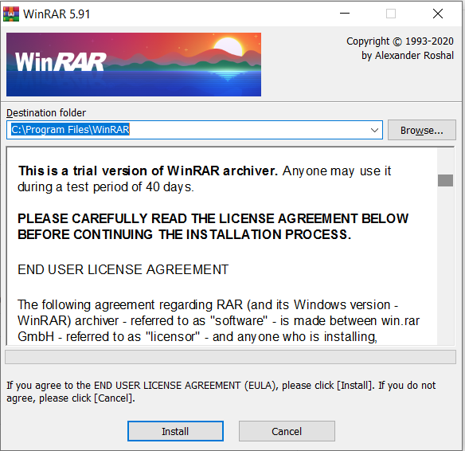
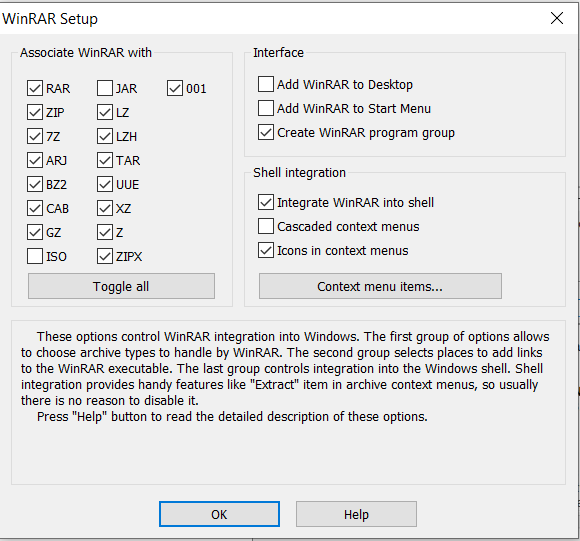
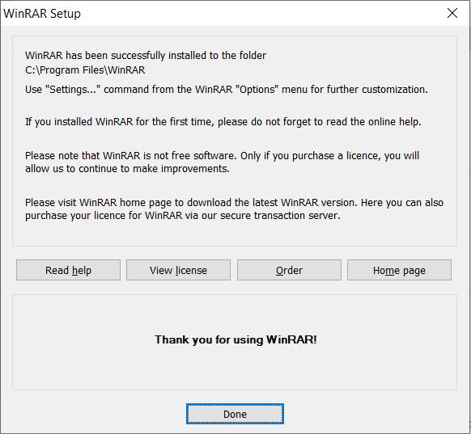

# My Technical Writing Portfolio

> Hello everyone that views this portfolio.

This portfolio is written using the markdown markup (quite a mouthful) language and using the Docsify document site generator that scaffolds a static documentation site.

Docsify is available at:  [Docsify] (https://docsify.js.org/).

As I hope to keep this as a static site with one page so you can navigate the different writing and documentation that I have developed in employment or in my own free time as a learning tool.

This portfolio is also a work in progress and will improve as my skills develop.

# User Guides

## WinRAR Installation Guide
This document describes how to install the WinRAR the data extraction and compressing tool.

### Requirements
Before WinRAR can be installed you must ensure that you are using a Microsoft windows, Linux or Android operating system.

| System       | Supported |
| ------------ | --------- |
| Windows      | Yes       |
| Linux        | Yes       |
| Android      | Yes       |
| Apple Mac OS | Yes       |

### Downloading WinRAR Using Windows
Before installing WinRAR we first need to download WinRAR from the official RARlab website.

1. Go to https://www.rarlab.com/download.htm 

2. Select the Winrar download you require. For this guide we will use the install file (link below)

   https://www.rarlab.com/rar/wrar591.exe but depending on your language or operating system you can choose the one which suits your needs.

3. Once the download has finished you can then open the WinRAR.exe file and begin the installation. 

Note. The file should have downloaded in your downloads folder. It may also appear in the bottom left of your internet browser.

### Installing WinRAR

1. Open the WinRAR install file that was downloaded in the previous section

2. Once the install window opens, the installer will ask you to install or cancel. To continue the installation the install button must be selected.

   

   

   

3. Once the files have finished installing the next installation screen will appear, on this screen it asks which file types want to be associated with the WinRAR application, for ease of use the default options will be the best choice. Note. these can be configured as depending on individual requirements.

   

4. Selecting the OK button will display the final install screen, which will show that the WinRAR application has been installed successfully.

   
   