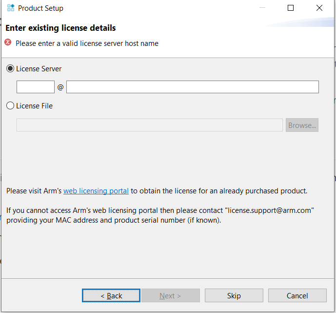
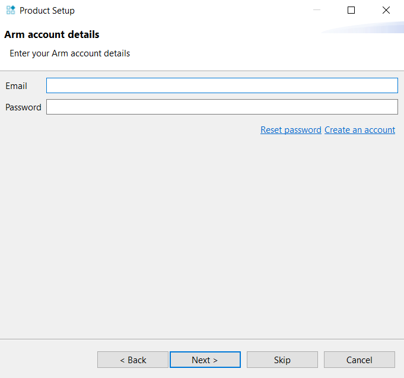
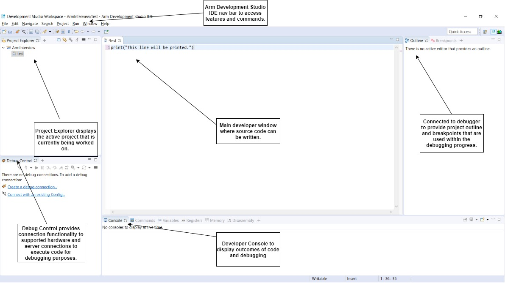
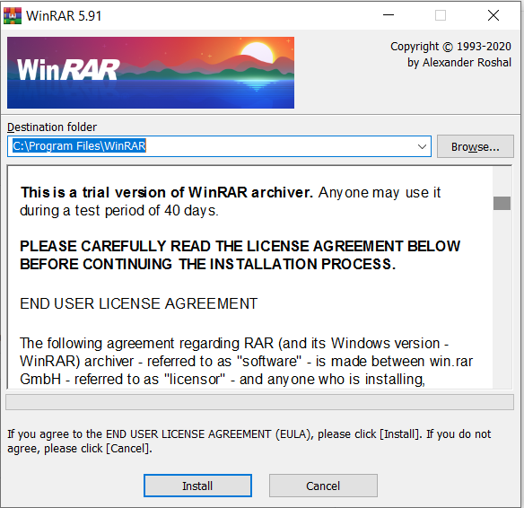
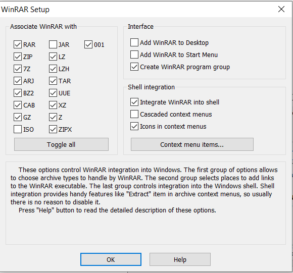
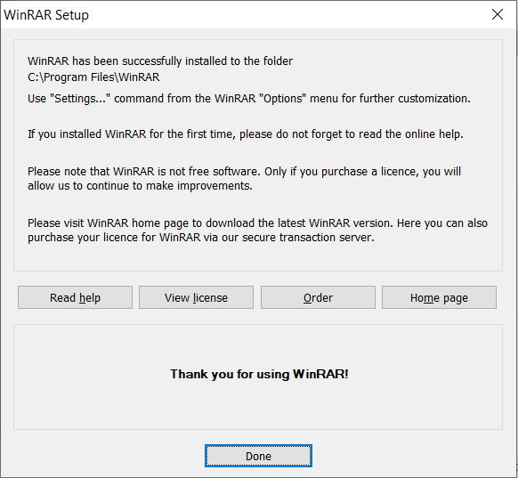
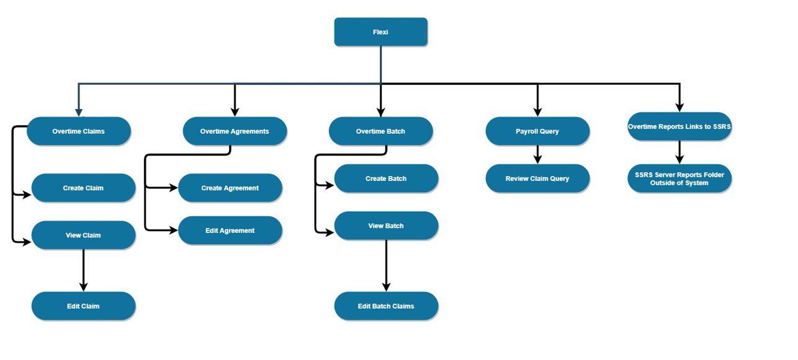
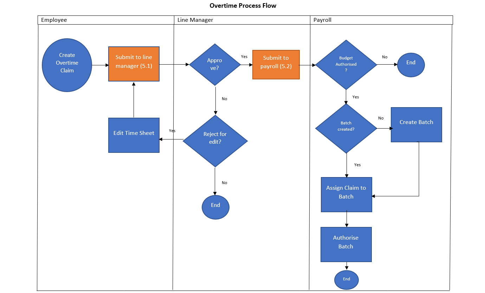
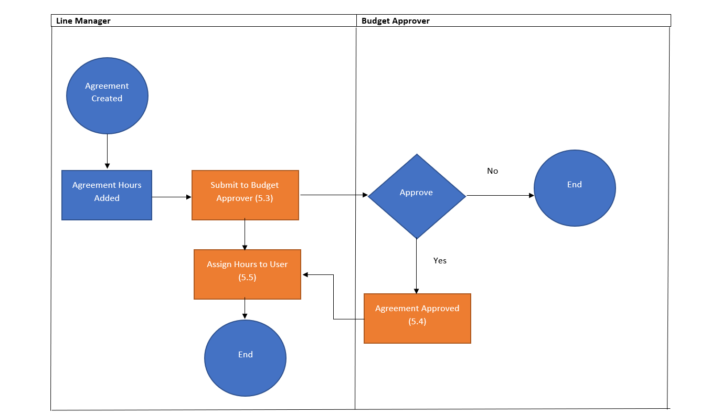

# My Technical Writing Portfolio

> Hello everyone that views this portfolio.

My name is Aaron Barkas and I am an I.T graduate with over 2 years experience in the I.T industry. Working as a Service Desk Analyst and a Database Analyst. I'm looking to begin a career in technical writing as I enjoy learning and creating content that people will use for there employment and potentially daily life.

This portfolio is written using the markdown markup (quite a mouthful) language and using the Docsify document site generator that scaffolds a static documentation site.

Docsify is available at:  [Docsify] (https://docsify.js.org/).

As I hope to keep this as a static site with one page so you can navigate the different writing and documentation that I have developed in employment or in my own free time as a learning tool.

This portfolio is also a work in progress and will improve as my skills develop.

# User Guides

User guides section will display the user guides I have created in the workplace or to give examples of my technical writing.

## Arm Development Studio

Arm Development Studio is an embedded C/C++ development toolchain designed specifically for Arm-based SoCs, from tiny microcontrollers to custom multicore processors. Designed alongside Arm processor IP, it accelerates system design and software development for Cortex-M, Cortex-R and Cortex-A processors.

###  Release Information

The following releases of this document have been made:

| Date       | Issue | Confidentiality               | Change      |
| ---------- | ----- | ----------------------------- | ----------- |
| 01/11/2020 | A-a-1 | Confidential-My Arm Interview | First Draft |
|            |       |                               |             |
|            |       |                               |             |

### Supported Devices

| Device Vendor                               | Preconfigured Targets/SoCs | Supported debug probes                                       |
| ------------------------------------------- | -------------------------- | ------------------------------------------------------------ |
|  | **Tegra 250**              | DSTREAM DSTREAM-ST DSTREAM-PT                        |
|                                             | **Tegra 250 Dev Kit**      | DSTREAM DSTREAM-ST DSTREAM-PT                        |
|                                             | **Tegra 3**                | DSTREAM DSTREAM-ST DSTREAM-PT                        |
|                                             | **Tegra 3 Dev Kit**        | DSTREAM DSTREAM-ST DSTREAM-PT                        |
|                                             | **Jetson**                 | DSTREAM DSTREAM-ST DSTREAM-PT ULINKPro ULINKProD ULINK |

This smaller list is just for example.

### System Requirements 

<table class="tg">
<thead>
  <tr>
    <th class="tg-0pky">Operating System</th>
    <th class="tg-0pky">Hardware Requirements Minimum</th>
    <th class="tg-0pky">Hardware Requirements Improved Performance*</th>
  </tr>
</thead>
<tbody>
  <tr>
    <td class="tg-0pky">Windows 7 SP1 Professional Edition</td>
    <td class="tg-0pky" rowspan="6">CPU: Dual Core RAM: 2GB HDD: 3gb Available</td>
    <td class="tg-0pky" rowspan="6">CPU: Dual Core RAM: 4GB 3GB of Hard Disk Space Available </td>
  </tr>
  <tr>
    <td class="tg-0pky">Windows 7 SP1 Enterprise Edition</td>
  </tr>
  <tr>
    <td class="tg-0pky">Windows 10</td>
  </tr>
  <tr>
    <td class="tg-0pky">Red Hat Enterprise Linux 7 Workstation</td>
  </tr>
  <tr>
    <td class="tg-0pky">Ubuntu Desktop Edition 16.04 LTS</td>
  </tr>
  <tr>
    <td class="tg-0pky">Ubuntu Desktop Edition 18.04 LTS</td>
  </tr>
</tbody>
</table>

*Improved performance requirements are recommended if you are required to:

* Debug large images.
* Use models with large simulated memory maps.
* Use ARM Streamline.

### Arm Development Studio Installation

Before you can install ARM Development Studio you must download the software from the ARM Developer website, the download to this installation file can be found here: [Arm Developer Studio Download](https://developer.arm.com/tools-and-software/embedded/arm-development-studio/downloads)

#### Procedure

1. Unzip the downloaded `.zip` file.

2. Run armds-<version>.exe from this location. This opens the Arm Development Studio setup wizard.

3. Follow the on-screen instructions.

   > ### Note
   >
   > - During installation, you might be prompted to install device drivers. Arm recommends that you install these drivers. They allow USB connections to DSTREAM and Energy Probe hardware units. They also support networking for the simulation models. These drivers are required to use these features.
   > - When the drivers are installed, you might see some warnings about driver software. You can safely ignore these warnings.

### Arm Development Studio - Product License

On executing the Arm Development Studio for the first time the application will prompt for the product license. Two options are available:

1. Add product license.
2. Obtain evaluation license.

#### Add Product License

Option one will allow entry of a license file or the network address of a license server.

#### Obtain Evaluation License

The evaluation license is a 30 day free trial of Arm Development Studio Gold. This requires an ARM developer account which can be created here: [Create Arm Developer Account](https://account.arm.com/1eb62d43-db15-492b-beab-8a32f6d90351/oauth2/v2.0/authorize?p=b2c_1a_arm_accounts.su&client_id=b7705cd8-fe14-4c60-9b70-a583ffad84ee&redirect_uri=https%3a%2f%2fdeveloper.arm.com%2flogin&response_mode=form_post&response_type=id_token&scope=openid&state=OpenIdConnect.AuthenticationProperties%3dGlwh53aKT_MiYfUbyut_GCMNL15QzZg0iRhOMDUDvARoP8WGCCHD3w5JlCgrE5TMTlVxI2z29oQ73z9LQ7n30a6B3pp2qVg3-gOhoJfZLC3MRUCOIO5QgmcFHalsTfBME5wlp3aI4ElC_nKqMvkV3r6_smhs7Pah3ma5IkXomPb8ORz8DS72DRfVr8yiYzYvs4XP8vCfYrO2H2Ax2miKK8kY8upwiHcJwNR6xvc_4Zf17R9p&nonce=637400972781724618.Yzg1OGQ0NWYtYmNjNi00NGIyLWE0MDMtMDBhZTM5NDY3ZGEwZWNmYmEyYmItYzZlNy00ZDU4LWI5YzgtNmE5MDg5ODhjMzUx&x-client-SKU=ID_NET&x-client-ver=1.0.40306.1554).

Additionally, links to the ARM Developer account creation can be found on the obtain evaluation license window.

 

### ARM Developer Studio IDE

The ARM Development Studio Integrated Development Environment (IDE) is where the development of source code and hardware debugging will be performed.

#### ARM Developer Studio IDE - Overview

### Uninstalling ARM Development Studio

Uninstalling the ARM Development Studio will remove the application and the associated files and folders from the device.

#### Windows - Uninstallation Procedure

1. Access control panel from the start menu.
2. Navigate to add or remove programs.
3. Select ARM Development Studio from the list of programs.
4. Select the uninstall button and follow the uninstallation process.

## WinRAR Installation Guide
This document describes how to install the WinRAR the data extraction and compressing tool.

### Requirements
Before WinRAR can be installed you must ensure that you are using a Microsoft windows, Linux or Android operating system.

| System       | Supported |
| ------------ | --------- |
| Windows      | Yes       |
| Linux        | Yes       |
| Android      | Yes       |
| Apple Mac OS | Yes       |

### Downloading WinRAR Using Windows
Before installing WinRAR we first need to download WinRAR from the official RARlab website.

1. Go to https://www.rarlab.com/download.htm 

2. Select the Winrar download you require. For this guide we will use the install file (link below)

   https://www.rarlab.com/rar/wrar591.exe but depending on your language or operating system you can choose the one which suits your needs.

3. Once the download has finished you can then open the WinRAR.exe file and begin the installation. 

Note. The file should have downloaded in your downloads folder. It may also appear in the bottom left of your internet browser.

### Installing WinRAR

1. Open the WinRAR install file that was downloaded in the previous section

2. Once the install window opens, the installer will ask you to install or cancel. To continue the installation the install button must be selected.

   

   

   

3. Once the files have finished installing the next installation screen will appear, on this screen it asks which file types want to be associated with the WinRAR application, for ease of use the default options will be the best choice. Note. these can be configured as depending on individual requirements.

   

4. Selecting the OK button will display the final install screen, which will show that the WinRAR application has been installed successfully.

   

# Web Application Documentation Examples

Any information in these examples of my work were created by me and are GDPR and Intellectual Property compliant and contain no identifiable data or application source code. Examples here are of generic Create Read Update Delete database web application examples. 

## Overtime Web Application

The overtime web application was created to allow staff to submit overtime claims. I was tasked to create the documentation from a managers perspective so that they could understand the system without the technical knowledge to do so.

### Site Map

The site map was created by me to show the different web pages on the web application and how a user would navigate from each page.

### Overtime Process Flow

The process flow was to show the user journey and the interaction between different users and their departments for the web application. Note. Orange objects referred to email examples in later sections of the documentation for GDPR and Intellectual Property issues I will not be able to display those email examples later in this portfolio.

 

### Process flow - Manager View

The manager view shows the user journey for the manager of the web application.

# Database Design

In this section I will display the database designs I have used professionally or as a hobby.

## Price Comparison Customer Data Example

This design wasn't used professionally but is based of the potential data a price comparison site will collect to compare customer data to match with the best quote from insurance providers. 

## Carpark System

In my previous employment I assisted with the created of a new carpark database to be used as a web application. This isn't the same design but has been changed as to not infringe any Intellectual property.

### ERD Carpark System Diagram

ERD diagram displays the relationships between each table within the database.

### Use Case Carpark System Diagram

A use case diagram details the different tasks that a user will be able to perform on the system.

